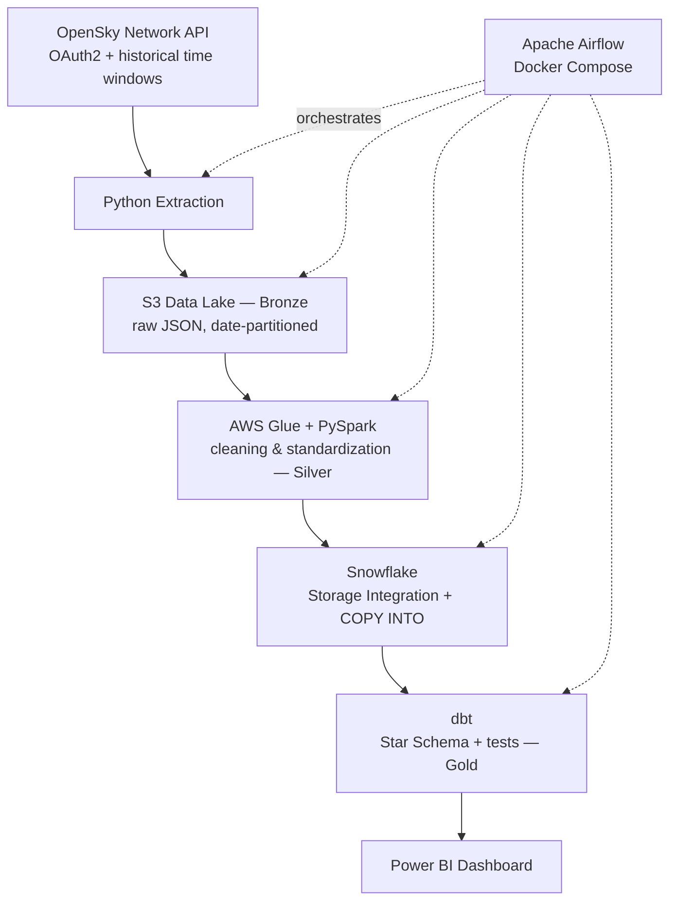
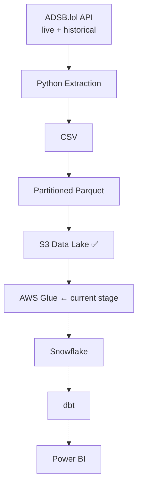

# ✈️ Flight Data Engineering Pipeline

An end-to-end data engineering project built on real-world flight tracking data, following the **Medallion Architecture** (Bronze → Silver → Gold). The project is split into two parallel tracks using different data sources and automation strategies.


---

## 📌 Overview

| | **Track 1 — OpenSky (Automated)** | **Track 2 — ADSB.lol (Large-scale)** |
|---|---|---|
| Source | OpenSky Network API (historical batches) | ADSB.lol (live + accumulated historical) |
| Volume | Grows incrementally per scheduled run | ~16M rows accumulated |
| Automation | Fully automated via Apache Airflow | Manual — orchestration not yet integrated |
| Status | ✅ Complete (Extract → Dashboard) | 🔶 In progress — currently at AWS Glue stage |

---

## 🧱 Track 1 — Fully Automated Pipeline



### Tech Stack

| Layer | Tool | Notes |
|---|---|---|
| Source | OpenSky Network API | OAuth2 (client_id/secret), `/flights/all` historical endpoint |
| Extraction | Python (`requests`) | Randomized historical time windows to avoid overlap between runs |
| Data Lake | AWS S3 | Hive-style partitioning (`year=/month=/day=`), unique run IDs to prevent collisions |
| Processing | AWS Glue (Serverless PySpark) | Deduplication, null filtering, **Job Bookmarks** for incremental processing |
| Warehouse | Snowflake | IAM-based Storage Integration (no static keys), External Stage, automated `COPY INTO` |
| Transformation | dbt (dbt-snowflake) | Staging layer + Star Schema (Fact/Dimensions), incremental logic based on `_loaded_at` |
| Orchestration | Apache Airflow (CeleryExecutor, Docker Compose) | `PythonOperator`, `GlueJobOperator`, and an isolated `DockerOperator` for dbt |
| Auth | Key Pair Authentication (RSA) | Non-interactive, MFA-safe authentication for Snowflake |
| Secrets | AWS Secrets Manager | Externalized credentials instead of plain `.env` |
| Testing | pytest + mocking | Unit tests for extraction logic and PySpark transformations (local SparkSession) |
| Data Quality | dbt tests | Built-in (`not_null`, `unique`, `relationships`, `accepted_range`) + custom singular tests |
| CI/CD | GitHub Actions | Runs the test suite automatically on every push |
| Environments | Snowflake Dev/Prod separation | Managed via dbt `targets` |

### Key Engineering Challenges Solved

- **Opt-in AWS regions causing timeouts** → migrated to a standard region (`eu-central-1`)
- **Dependency conflicts between dbt and Airflow's Python environment** → isolated dbt in its own Docker container (`DockerOperator` + official `dbt-labs/dbt-snowflake` image)
- **MFA blocking programmatic Snowflake connections** → switched to Key Pair Authentication
- **Data collisions across randomized historical runs** → unique run-based file naming + incremental logic rebuilt around `_loaded_at` (load time) instead of `departure_time` (event time)
- **Path mismatches between the Windows host and Linux containers** → resolved via dbt's `env_var()` instead of hardcoded paths

---

## 🧱 Track 2 — ADSB.lol (Large-Scale, In Progress)



Live sampling from ADSB.lol was initially capped at ~7,000 rows per snapshot — not enough for meaningful analysis. The pipeline was redesigned to accumulate data over time instead, reaching **~16 million rows**, closer to a real big-data scenario. Unlike Track 1, data is converted to **partitioned Parquet before landing in S3** rather than after, given the much larger volume.

**Remaining steps:** finish Glue cleaning (with Bookmarks enabled from the start), build the Snowflake integration, extend/adapt the dbt models, connect Power BI, and eventually bring this track under Airflow as well.

---

## 🎓 Skills Demonstrated

- Secure REST API consumption (timeouts, retries, rate limiting, OAuth2)
- Data lake partitioning strategies
- Distributed processing with PySpark (local + AWS Glue Serverless)
- Incremental processing (Glue Bookmarks, dbt incremental models)
- Dimensional modeling (Star Schema, surrogate keys, window functions)
- Automated data quality testing (dbt)
- Environment isolation (Dev/Prod, containerized dependency separation)
- Secrets management & secure non-interactive authentication
- Full orchestration with Apache Airflow
- CI/CD with GitHub Actions
- Unit testing for both application code and Spark transformations (pytest)

---

## 🚀 Getting Started

```bash
git clone <this-repo>
cd flight-data-project
python -m venv venv
source venv/bin/activate  # Windows: venv\Scripts\activate
pip install -r requirements.txt
cp .env.example .env       # fill in your credentials
pytest tests/ -v           # verify the test suite passes
```

Airflow (Docker required):
```bash
cd airflow
docker compose up airflow-init
docker compose up -d
# → http://localhost:8080
```

dbt:
```bash
cd flight_transforms
dbt run
dbt test
```

---

## 📄 License

This project is for educational/portfolio purposes.
